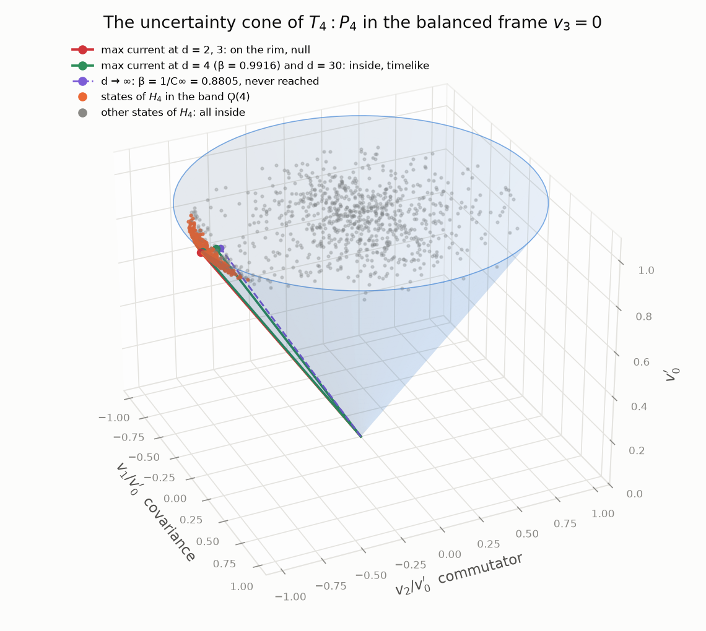
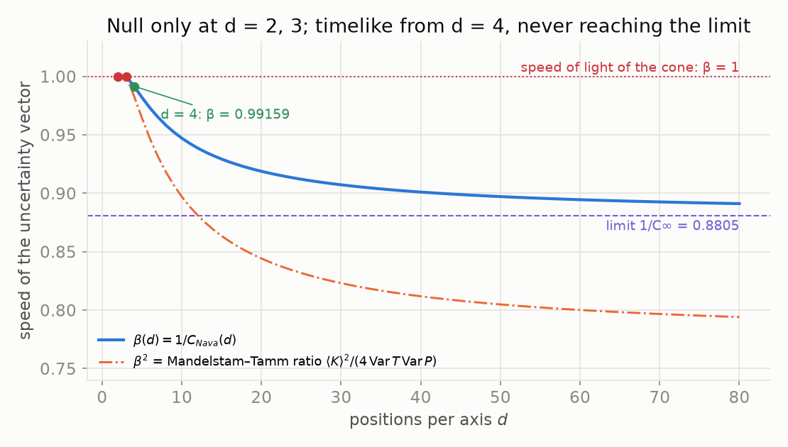
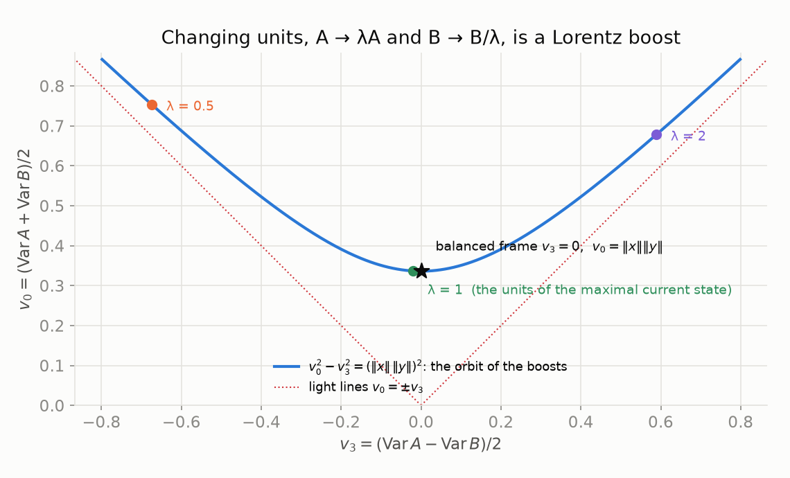
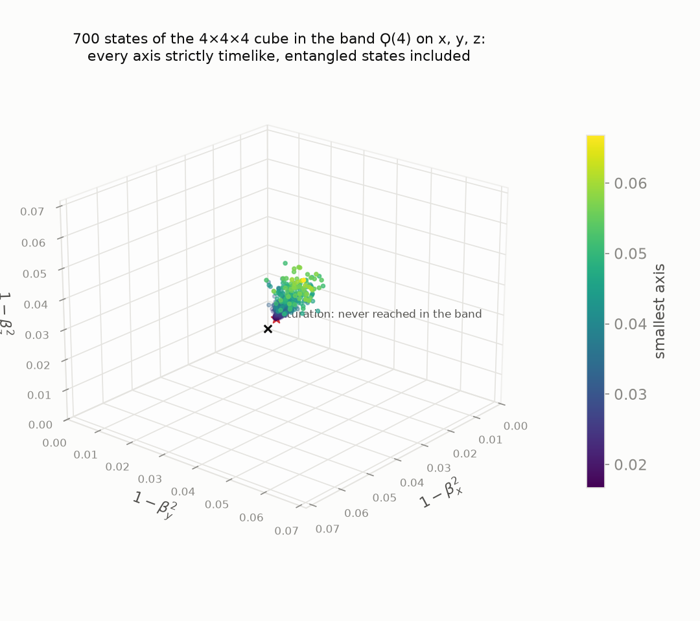
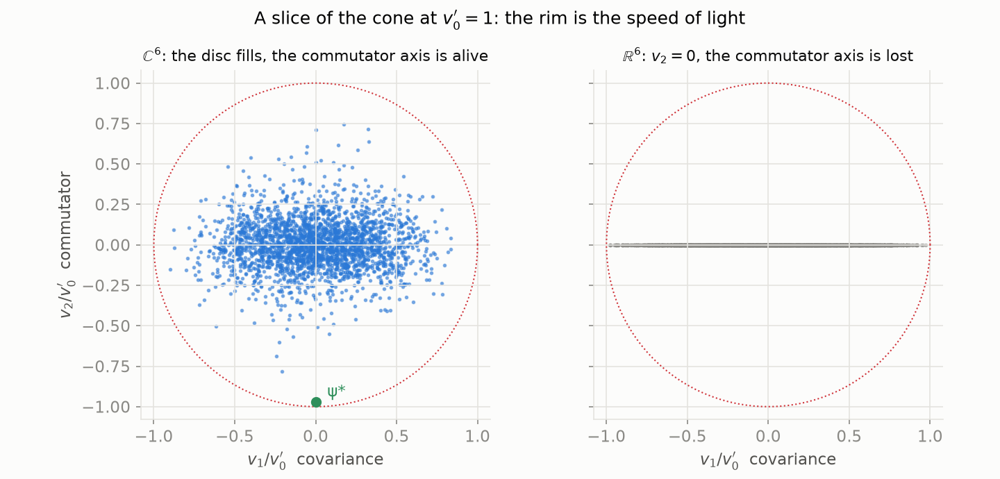

# NRS³ · The uncertainty cone

**The uncertainty of a pair of observables is a vector of Minkowski space.** On `H_d = ℂ^d`, the
Gram matrix of the fluctuations of transport `T_d` and position `P_d` is a Hermitian `2 × 2`
matrix, and a Hermitian `2 × 2` matrix is a four-vector whose determinant is the Minkowski
interval (van der Waerden 1929). Robertson–Schrödinger is the light cone; saturation is a null
vector; changing units is a Lorentz boost; and the quantum of NRS³ keeps the vector **strictly
inside the cone** — at the maximal current state from four positions on, and in the band `Ϙ(d)` for every state, on
every axis, entangled or not. Its speed is `1 / C_Nava(d)`, and its square is the
Mandelstam–Tamm ratio. Lean 4, Mathlib, and the base repository.

**[▶ Try it: the cone of NRS³ — move d, the state, the units, ℂ or ℝ](https://naype888-cloud.github.io/nrs3-uncertainty-cone/)** ·
**[▶ Try it: SL(2, ℂ) — boost and rotate the vector, it never leaves the cone](https://naype888-cloud.github.io/nrs3-uncertainty-cone/lorentz.html)** ·
**[▶ Pruébalo (español): el triángulo de la incertidumbre y la dilatación del tiempo](https://naype888-cloud.github.io/nrs3-uncertainty-cone/dilatacion.html)**



## The four-vector

For a state `ψ`, `x = (T − ⟨T⟩)ψ` and `y = (P − ⟨P⟩)ψ`. The Gram matrix

`G = !![‖x‖², ⟪x, y⟫; ⟪y, x⟫, ‖y‖²] = v₀ 1 + v₁ σ₁ − v₂ σ₂ + v₃ σ₃`

has components `v = ((‖x‖² + ‖y‖²)/2, Re ⟪x, y⟫, Im ⟪x, y⟫, (‖x‖² − ‖y‖²)/2)`: the covariance is
`v₁` and half the commutator is `v₂`. And `det G = v₀² − v₁² − v₂² − v₃²`.

| Reading | Minkowski |
|---|---|
| Robertson–Schrödinger, `G ≥ 0` | `v` in the closed future cone |
| Gram defect, `det G` | interval `τ²` |
| saturation (`d = 2, 3` at the maximal current state) | null vector, on the cone |
| the quantum (`d ≥ 4`; the band) | timelike vector, strictly inside |
| units: `A → λA`, `B → B/λ` | boost `diag(λ, λ⁻¹)` along `v₃` |
| `cos θ_NRS = 1 / C_Nava(d)` | speed `β` of `v` in the frame `v₃ = 0` |
| Mandelstam–Tamm ratio at the maximal current state | `β²` |



## Results

### `VanDerWaerden1929` — Hermitian matrices are four-vectors

| Statement | Lean |
|---|---|
| `det (v₀ 1 + v·σ) = v₀² − v₁² − v₂² − v₃²` | `det_herm` |
| every Hermitian `2 × 2` matrix is `v₀ 1 + v·σ` | `herm_coords` |
| positive semidefinite means future causal | `future_of_posSemidef` |
| `SL(2, ℂ)` keeps the interval and the future cone | `det_conj`, `posSemidef_conj` |
| the Gram matrix of two vectors is future causal | `robertsonSchrodinger_future` |
| `A → λA`, `B → B/λ` is the boost `diag(λ, λ⁻¹)` | `gram_boost`, `interval_gram_boost` |

### `Cone` — the cone of `T_d : P_d`

| Statement | Lean |
|---|---|
| `G` in the components of `v` | `gramMatrix_eq` |
| `det G = η(v, v)`, the Gram defect of `D1` | `det_gramMatrix`, `interval_eq_gramDefectC` |
| Robertson–Schrödinger: `0 ≤ v₀`, `0 ≤ η(v, v)` | `mem_futureCone` |
| null iff Cauchy–Schwarz is saturated | `interval_eq_zero_iff` |
| the rescaling is a boost; the interval does not move | `coneVector_smul`, `boost_coeff`, `interval_smul` |
| a rescaling reaches `v₃ = 0`, with `v₀ = ‖x‖ ‖y‖` | `balanced_frame` |
| `η(v, v) = (‖x‖ ‖y‖)² (1 − β²)` | `interval_eq_speed` |
| at the maximal current state, `β = 1 / C_Nava(d)` | `speed_maxCurrentState` |
| null iff `d = 2, 3`; timelike from `d = 4` | `null_maxCurrentState_iff`, `timelike_maxCurrentState` |



### `Band` — strictly inside, for every state, in every direction

On the cube `dx × dy × dz`, if the speeds of a unit state on `x`, `y`, `z` lie in the bands
`Ϙ(dx)`, `Ϙ(dy)`, `Ϙ(dz)`:

| Statement | Lean |
|---|---|
| the four-vectors of the three axes are strictly timelike, entangled states included (`D49e`) | `timelike_of_band` |
| det\|NRS³, Robertson 1934 for the six observables, is strict (`D49t`) | `robertson_det_strict_of_band` |

Robertson 1934 holds for every finite family of observables (`robertson_det`, base `D49`); in
the band it is strict on the cube. Outside the band the defect can vanish only trivially:
Robertson as `0 = 0` on position eigenstates (`D47`) and on the mirror state, where nothing moves
(`D49m`).



### `TimeDilation` — the right triangle of the uncertainty

Robertson–Schrödinger is Cauchy–Schwarz in the Hilbert space; in the cone it is causality. Between
the two sits a right triangle: the hypotenuse `‖x‖ ‖y‖`, the angle `θ` between the fluctuations,
the leg light resolves `‖⟪x, y⟫‖ = ‖x‖ ‖y‖ cos θ`, and the leg of proper time
`τ = √η(v, v) = ‖x‖ ‖y‖ sin θ`.

| Statement | Lean |
|---|---|
| `τ = ‖x‖ ‖y‖ sin θ`, any pair, any state | `properTime_eq_mul_sin` |
| `‖⟪x, y⟫‖ = ‖x‖ ‖y‖ cos θ` | `norm_inner_eq_mul_cos` |
| time dilation: `τ ≤ v₀` | `properTime_le_time` |
| at the maximal current state, `τ = ‖x‖ ‖y‖ sin θ_NRS(d)` | `properTime_maxCurrentState` |
| `τ > 0` from `d = 4` on; `τ = 0` exactly at `d = 2, 3` | `properTime_maxCurrentState_pos`, `null_maxCurrentState_iff` |
| the contrast `τ / ‖⟪x, y⟫‖ = tan θ_NRS(d)`, strictly between the two saturations `0` (`d = 2, 3`) and `√(C∞² − 1)` (never reached) | `contrast_maxCurrentState` |

Saturation is `θ = 0`: all of the hypotenuse is the leg of light and the proper time is zero. The
quantum opens the NRS angle and with it the first time. In Physlib the same triangle is
`TimeDilation.lean`, where `τ ≤ v₀` comes from the reverse Cauchy–Schwarz inequality of causal
vectors (Kevorkian), next to Langevin's twin paradox (1911).

### `RoundTrip` — going and coming back

Reversing the direction, `y ↦ -y`, reflects the four-vector: `v₁`, `v₂` change sign, `v₀`, `v₃`
do not, and the proper time is the same both ways. The way there and back has no net covariance
and no net commutator, yet it carries at least twice the proper time of one way: the round trip
pays twice, and returning to the start does not undo it.

| Statement | Lean |
|---|---|
| same proper time going and coming back | `properTime_neg` |
| no net `v₁`, no net `v₂` | `round_trip_one`, `round_trip_two` |
| `2 τ ≤ τ(there + back)` | `two_mul_properTime_le_round_trip` |
| positive from `d = 4` on | `round_trip_maxCurrentState_pos` |

In Physlib the same statement is `RoundTrip.lean`, where `2 τ ≤ τ(there + back)` is Kevorkian's
reverse triangle inequality of causal vectors.

## Why `ℂ`

Over `ℝ` the inner product is real, `v₂ = Im ⟪x, y⟫ = 0` for every state, and the commutator
axis is gone: the cone of the pair drops from `ℝ^{1,3}` to `ℝ^{1,2}` and the quantum, which
lives in `v₂`, cannot appear. A real space carries it only with a complex structure `J`,
`J² = −1`, which is `ℂ^d` in real coordinates.



## Scope

The four components are the variances, the covariance and the commutator of the pair. In
Physlib the same vector is a `Lorentz.Vector 3` that causally follows the origin, and its
commutator component is half the velocity `⟨J⟩` of the chain, bounded by the speed limit
(`PhyslibAlpha/CondensedMatter/TightBindingChain/CausalCone.lean`). The statements are on
`H_d = ℂ^d` with `d` finite;
`d → ∞` is the Szegő limit `C∞ = √(π²/3 − 2)`, `β∞ = 1/C∞ ≈ 0.8805`, never reached.

## History

van der Waerden (1929) built spinor calculus on the identification of Hermitian `2 × 2` matrices
with Minkowski vectors and of `SL(2, ℂ)` with the Lorentz group; Minkowski's geometry is of 1908,
Lorentz's group of 1904–05. Robertson (1929) and Schrödinger (1930) gave the uncertainty
inequality, Robertson (1934) its determinant form for several observables; Mandelstam and Tamm
(1945) read it as a bound on the speed of a state. Everything here could have been stated then;
the proofs use modern tools.

## Build

Lean 4 `v4.34.0`, Mathlib `v4.34.0`, and the base repository
[`nava-robertson-schrodinger`](https://github.com/naype888-cloud/nava-robertson-schrodinger)
(pinned in `lakefile.toml`).

```bash
lake exe cache get
lake build
lake env lean Verification/Axioms.lean   # only propext, Classical.choice, Quot.sound
```

Every file: no `sorry`, no axioms beyond the standard three, lines of at most 100 characters,
English headers. Figures: `python3 docs/simulation/figures_uncertainty_cone.py` (NumPy,
Matplotlib); the interactive pages compute from the same matrices in `docs/cone-core.js`.

## Timeline 1911–1945

NRS answers a question of the Solvay era with later tools. The series is placed in that window:
what falls inside it is the history the theorem belongs to; what falls after it is a proposal,
not part of NRS³.

| Year | Event | Repository |
|---|---|---|
| 1911 | First Solvay conference: radiation and the quanta | |
| 1911 | Langevin: the twin paradox, proper time against coordinate time | **[`nrs3-uncertainty-cone`](https://github.com/naype888-cloud/nrs3-uncertainty-cone)** (this one, `TimeDilation`) |
| 1911–12 | Poincaré: Planck's law forces discrete levels | [`nrs3-poincare`](https://github.com/naype888-cloud/nrs3-poincare) |
| 1915–20 | Szegő: limit theorems for Toeplitz matrices (the limit `C∞`, `D8`) | [base repository (NRS, NRS³)](https://github.com/naype888-cloud/nava-robertson-schrodinger) |
| 1917–27 | Einstein and de Sitter: `Λ` and the empty universe; Friedmann and Lemaître: the expanding universe | [`nrs3-de-sitter`](https://github.com/naype888-cloud/nrs3-de-sitter) |
| 1925–27 | Pauli: exclusion, shells `2n²`, spin matrices | [`nrs3-pauli-dirac`](https://github.com/naype888-cloud/nrs3-pauli-dirac) |
| 1927 | Heisenberg's relation; fifth Solvay conference: electrons and photons | |
| 1928 | Dirac: the `4 × 4` gamma matrices | [`nrs3-pauli-dirac`](https://github.com/naype888-cloud/nrs3-pauli-dirac) |
| **1929** | **van der Waerden: spinors, `SL(2, ℂ)` on Hermitian matrices; the uncertainty cone** | **[`nrs3-uncertainty-cone`](https://github.com/naype888-cloud/nrs3-uncertainty-cone)** (this one) |
| 1929 | Weyl, Fock–Ivanenko: Dirac in curved spacetime | [`nrs3-pauli-dirac`](https://github.com/naype888-cloud/nrs3-pauli-dirac) |
| 1929–30 | Robertson and Schrödinger: the uncertainty inequality | [base repository (NRS, NRS³)](https://github.com/naype888-cloud/nava-robertson-schrodinger) |
| 1934 | Robertson: the determinant for several observables (det\|NRS³) | [base repository](https://github.com/naype888-cloud/nava-robertson-schrodinger); strict in the band: **this one** |
| 1945–46 | Mandelstam–Tamm: the time–energy bound; Rao (1945), Cramér (1946) | [`nrs3-mandelstam-tamm-cramer-rao`](https://github.com/naype888-cloud/nrs3-mandelstam-tamm-cramer-rao) |

**Tools from after the window.** Niven (1956), Fiedler (1973), Lean 4 and Mathlib. The question
is of 1929; the tools are later; the checking is of 2026.

## The mosaic

- [NRS and NRS³ — the base theorem](https://github.com/naype888-cloud/nava-robertson-schrodinger)
- [NRS³ · Mandelstam–Tamm and Cramér–Rao](https://github.com/naype888-cloud/nrs3-mandelstam-tamm-cramer-rao)
- [NRS³ · Landauer and Carnot](https://github.com/naype888-cloud/nrs3-landauer-carnot)
- [NRS³ · de Sitter](https://github.com/naype888-cloud/nrs3-de-sitter)
- [NRS³ · Penrose](https://github.com/naype888-cloud/nrs3-penrose) (proposal)
- [NRS³ · Pauli–Dirac](https://github.com/naype888-cloud/nrs3-pauli-dirac)
- **[NRS³ · The uncertainty cone](https://github.com/naype888-cloud/nrs3-uncertainty-cone)** (this one)
- [NRS³ · Poincaré](https://github.com/naype888-cloud/nrs3-poincare)
- [NRS³ · Defect and curvature](https://github.com/naype888-cloud/nrs3-defect-curvature)
- [NRS³ · Rovelli — Loop Quantum Gravity](https://github.com/naype888-cloud/nrs3-rovelli-lqg) (proposal)
- [NRS³ · Dark](https://github.com/naype888-cloud/nrs3-dark)

## License

NRS Noncommercial License 1.0.0, see [`LICENSE`](LICENSE). Author: Eduardo Nava-Hernandez.
